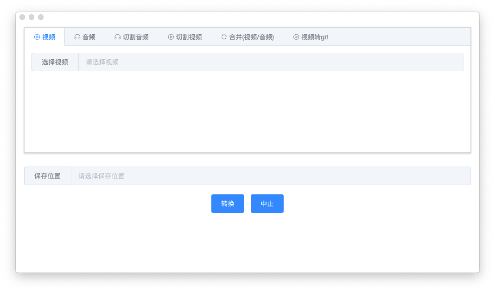
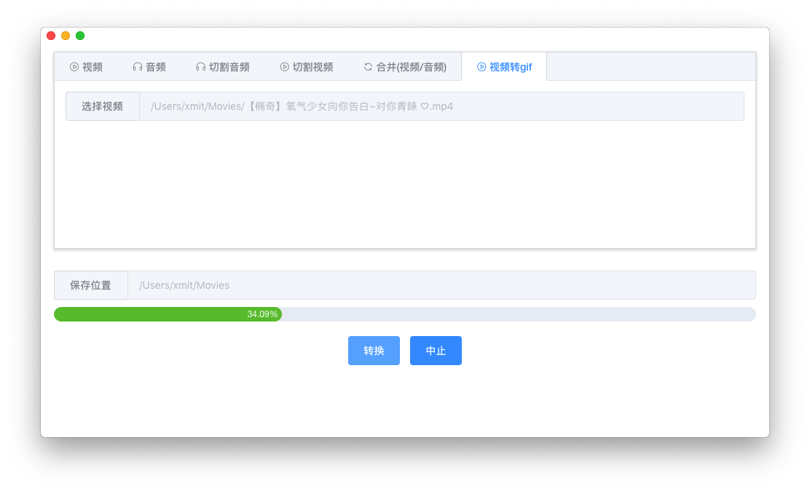

# ffmpegGUI

### 项目说明

基于 electron-vue + ffmpeg 的 GUI

### 项目截图




### 如何开启硬件加速（只是以我个人的经验，不代表100%正确的，不对的地方请指点）

 **注意：** 在开启硬件加速时，转码的速度虽然快了，但视频质量会出现大幅下滑，目前解决办法只能通过设置高码率来解决，目前我的做法是在原码率的基础上提高1.5倍，基本能保证视频质量，但体积也会增加1.5倍（如果有更好的方法请告诉我）

以我这个项目为例，首先通过执行 `ffmpeg -hwaccels` 来获取当前机器支持哪些硬件加速的方法，不同的平台开启硬件加速的方法不一样

查看机器支持的硬件加速的方法：

```js
// node子进程的方式
let exec = require("child_process").exec;
exec(`${ffmpegPath} -hwaccels`, (err, stdout, stderr) => {
  console.log(stdout); // Hardware acceleration methods: videotoolbox
});
```

```js
// 原生ffmpeg的方式
ffmpeg -hwaccels
```

查看机器支持的编码器（encoders）：

```js
// node子进程的方式
let exec = require("child_process").exec;
exec(`${ffmpegPath} -encoders`, (err, stdout, stderr) => {
  console.log(stdout); 
  // 这里会打印出很多信息，只需要找出带有之前带有videotoolbox的就行（这里的 videotoolbox 是上次查到的支持硬件加速的方法）
  // ......
  // V..... h264_videotoolbox    VideoToolbox H.264 Encoder (codec h264)
  // V..... hevc_videotoolbox    VideoToolbox H.265 Encoder (codec hevc)
  // ......
});
```

```js
// 原生ffmpeg的方式
ffmpeg -encoders
```

把上面查到的结果带到`ffmpeg` 里执行即可（以下代码是我项目的例子，如果是命令的方式，直接带上这个参数执行就行）

```js
ffmpeg()
  .input('/dev/video')
  .videoCodec('h264_videotoolbox') // H264，hevc_videotoolbox(h265)
  .inputFormat('mov')
```

```js
// 原生ffmpeg的方式
ffmpeg -vcodec h264_videotoolbox
```

以上就可以开启硬件加速功能了

### 待完善

- [ ] 减小打包过大的问题（目前默认是打包全平台的 ffmpeg）
- [ ] 增加配置项（目前所有的配置默认都是写死的，比如转视频时默认会把任意格式的视频转MP4）
- [ ] 切割音频和视频时可以实时预览
- [ ] 转码核心代码优化
- [ ] 提供可以让用户输入 ffmpeg 命令的形式执行转码操作（目前基本可以实现）
- [ ] 界面优化
- [ ] 用户可选保持原始目录路径
- [ ] 加入文件夹监控，自动队列转码（支持数据库和 webhook）
- [ ] 下载 M3u8 的链接
- [ ] 批量转码（指定线程池数量来优化性能）

### 构建应用

``` bash
# 安装依赖
npm install

# 热加载服务运行在 localhost: 9080
npm run dev

# 打包项目
npm run build
```

### 赞助我

如果觉得这些内容不错，请我喝杯咖啡吧。


