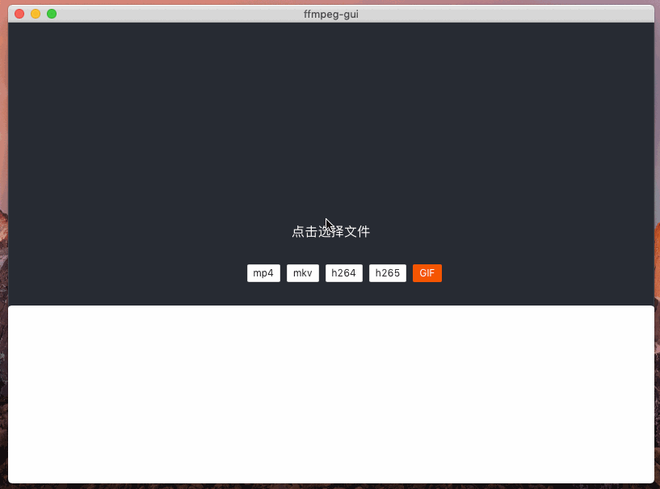

# ffmpegGUI

### 项目说明

ffmpeg-gui 是一个基于 tauri 框架开发的跨平台软件，可以用它做视频音频转码、视频音频合并、视频转 GIF 等功能

### 项目截图



### 待完善

- [ ] 界面优化
- [ ] ffmpeg 二进制文件异步下载更新
- [ ] 增加配置项
- [ ] 用户可选保持原始目录路径
- [ ] 加入文件夹监控，自动队列转码（支持数据库和 webhook）
- [ ] 下载 M3u8 的链接
- [ ] 批量转码（指定线程池数量来优化性能）

### 环境搭建

[Windows](https://tauri.studio/v1/guides/getting-started/prerequisites/#setting-up-windows)

[MacOS](https://tauri.studio/v1/guides/getting-started/prerequisites/#setting-up-macos)

### 构建应用

```bash
# 安装依赖
npm install

# 开发模式
npm run tauri dev

# 打包项目
npm run tauri build
```

### 赞助我

如果觉得这些内容不错，请我喝杯咖啡吧。


### Star History

[](https://star-history.com/#zhen-ke/ffmpegGUI&Date)
