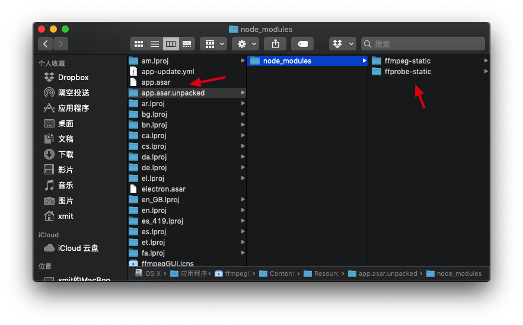
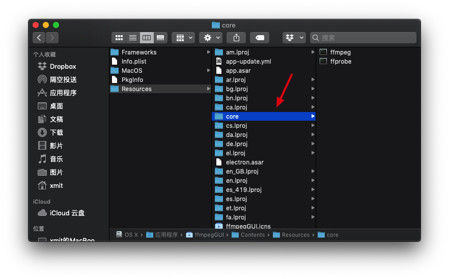

# ffmpegGUI

### 项目说明

基于 electron-vue + ffmpeg 的 GUI

### 项目截图


### 遇到的问题

#### 如何开启硬件加速（只是以我个人的经验，不代表 100%正确的，不对的地方请指点）

**注意：** 在开启硬件加速时，转码的速度虽然快了，但视频质量会出现大幅下滑，目前解决办法只能通过设置高码率来解决，目前我的做法是在原码率的基础上提高 1.5 倍，基本能保证视频质量，但体积也会增加 1.5 倍（如果有更好的方法请告诉我）

以我这个项目为例，首先通过执行 `ffmpeg -hwaccels` 来获取当前机器支持哪些硬件加速的方法，不同的平台开启硬件加速的方法不一样

查看机器支持的硬件加速的方法：

```js
// node子进程的方式
let exec = require('child_process').exec;
exec(`${ffmpegPath} -hwaccels`, (err, stdout, stderr) => {
  console.log(stdout); // Hardware acceleration methods: videotoolbox
});
```

```js
// 原生ffmpeg的方式
ffmpeg - hwaccels;
```

查看机器支持的编码器（encoders）：

```js
// node子进程的方式
let exec = require('child_process').exec;
exec(`${ffmpegPath} -encoders`, (err, stdout, stderr) => {
  console.log(stdout);
  // 这里会打印出很多信息，只需要找出带有之前带有videotoolbox的就行（这里的 videotoolbox 是上次查到的支持硬件加速的方法）
  // ......
  // V..... h264_videotoolbox    VideoToolbox H.264 Encoder (codec h264)
  // V..... hevc_videotoolbox    VideoToolbox H.265 Encoder (codec hevc)
  // ......
});
```

```js
// 原生ffmpeg的方式
ffmpeg - encoders;
```

把上面查到的结果带到`ffmpeg` 里执行即可（以下代码是我项目的例子，如果是命令的方式，直接带上这个参数执行就行）

```js
ffmpeg()
  .input('/dev/video')
  .videoCodec('h264_videotoolbox') // H264，hevc_videotoolbox(h265)
  .inputFormat('mov');
```

```js
// 原生ffmpeg的方式
ffmpeg -vcodec h264_videotoolbox
```

以上就可以开启硬件加速功能了

#### 打包后 electron asar 不能使用二进制文件的问题

```js
// 修复 electron asar 不能使用二进制文件的问题
if (process.env.NODE_ENV !== 'development') {
  ffmpegPath = ffmpegPath.replace('app.asar', 'app.asar.unpacked');
  ffprobePath = ffprobePath.replace('app.asar', 'app.asar.unpacked');
}
```

在打完包后，会把相关的二进制文件放到`app.asar.unpacked`里，默认会放到`app.asar`里



#### 如何通过 Webpack 打包不同平台的二进制文件到 APP 里？

首先通过 `process.platform`来判断平台，然后用 `CopyWebpackPlugin` 插件从 `node_modules` 把相关平台的的二进制文件复制出来

**webpack.renderer.config**

```js
if (process.env.NODE_ENV === 'production') {
  const ffmpegBasePath = '../node_modules/ffmpeg-static/bin/'; // ffmpeg-static

  const { platform } = process;

  const ffmpegPathMap = {
    darwin: 'darwin/x64/ffmpeg'
  };

  const ffmpegPath = ffmpegBasePath + ffmpegPathMap[platform];

  rendererConfig.plugins.push(
    new CopyWebpackPlugin([
      {
        from: path.join(__dirname, ffmpegPath),
        to: path.join(__dirname, '../core'),
        ignore: ['.*']
      }
    ])
  );
}
```

调整二进制文件的权限，并设置 `ffmpeg` 的打包后的路径（复制出来的二进制文件似乎有权限问题）

**core.js**

```js
import ffmpeg from 'fluent-ffmpeg';
import { resolve } from 'path';

// 找出复制出来的路径
let basePath = resolve(__dirname, '../../../core/');

if (process.env.NODE_ENV == 'production') {
  const fs = require('fs');

  let realFfmpegPath = basePath + '/ffmpeg';

  fs.stat(realFfmpegPath, (err, stats) => {
    if (err) return;
    // 如果 ffmpeg、ffprobe 非 777 权限，则设置成 777
    if (stats.mode !== 33279) {
      fs.chmod(realFfmpegPath, '0777', err => {
        if (err) {
          console.error(err);
          return;
        }
        console.log('ffmpeg 修改权限成功');
      });
    }
  });

  ffmpegPath = realFfmpegPath;
}

ffmpeg.setFfmpegPath(ffmpegPath);
```

把二进制文件打包到 APP 里（通过 `electron builder` 的 `extraResources` 把二进制文件拷贝到 APP 里）

**package.json**

```json
"mac": {
  "extraResources": {
    "from": "./core/",
    "to": "./core/",
    "filter": ["**/*"]
  }
}
```


### 待完善

- [x] 减小打包过大的问题（目前默认是打包全平台的 ffmpeg）
- [ ] 增加配置项（目前所有的配置默认都是写死的，比如转视频时默认会把任意格式的视频转 MP4）
- [ ] 切割音频和视频时可以实时预览
- [ ] 转码核心代码优化
- [ ] 提供可以让用户输入 ffmpeg 命令的形式执行转码操作（目前基本可以实现）
- [ ] 界面优化
- [ ] 用户可选保持原始目录路径
- [ ] 加入文件夹监控，自动队列转码（支持数据库和 webhook）
- [ ] 下载 M3u8 的链接
- [ ] 批量转码（指定线程池数量来优化性能）

### 构建应用

```bash
# 安装依赖
npm install

# 热加载服务运行在 localhost: 9080
npm run dev

# 打包项目
npm run build
```

### 赞助我

如果觉得这些内容不错，请我喝杯咖啡吧。


